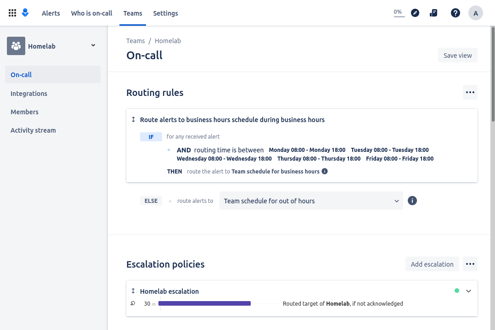

# Opsgenie Terraform

These resources should be built with Terraform: https://www.terraform.io

Opsgenie is on-call and alert management software. It offers basic alerting and on-call management for small teams up to 5 users free of charge.

## Pre-requisites

### Install Terraform

On a Debian-based system:

```
sudo apt install -y curl
curl -fsSL https://apt.releases.hashicorp.com/gpg | sudo apt-key add -
sudo apt-add-repository "deb [arch=amd64] https://apt.releases.hashicorp.com $(lsb_release -cs) main"
sudo apt install -y terraform=1.3.4
sudo apt-mark hold terraform
```

On a RHEL-based system:

```
sudo yum install -y yum-utils
sudo yum-config-manager --add-repo https://rpm.releases.hashicorp.com/RHEL/hashicorp.repo
sudo yum -y install terraform
```

### Configure AWS S3 and DynamoDB for Remote State Files

See configuration instructions here:

https://www.lisenet.com/2020/terraform-with-aws-s3-and-dynamodb-for-remote-state-files/

See required IAM account permissions [docs/terraform-aws-iam-permissions.json](./docs/terraform-aws-iam-permissions.json).

### Create Opsgenie API Key

You will Opsgenie application API key to use Terraform. Consult Opsgenie documentation for how to create it.

## Deployment

Terraform will read environment variables. You can set the shell to use something like this to avoid being prompted to enter Opsgenie API key:

```
export TF_VAR_opsgenie_api_key=<value>
export TF_VAR_opsgenie_user_email=<value>
export TF_VAR_opsgenie_user_name=<value>
```

From this directory, deploy the stack:

```
terraform init -upgrade
terraform apply
```



## Reference

https://registry.terraform.io/providers/opsgenie/opsgenie/latest/docs
